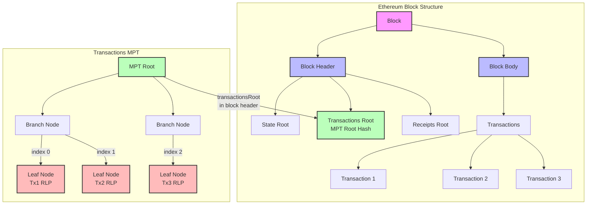

# verify_sent_tx_prep

From a hash of a transaction
Private inputs
---
* Gets the RLP bytes of the tx ✅
* Gets the proof path ✅
* Gets the proof nodes ✅
  * Get the block that included the tx
  * Build the TRIE locally 
  * Get the index of the transaction
  * Create the TRIE proof (nodes that lead to the particular transaction being proven)
---
Public inputs
* block_tx_root ✅
* expected_to
* expected_value

To feed a zero knowledge circuit that verifies that the prover succesfully executed a transaction on-chain with an `expected_to` and an `expected_value`.

----

Merkle-Patricia-Tree
A Merkle-Patricia-Tree combines three ideas:
1. Trie (prefix tree): stores key ->value mappings by walking fixed-size "digits" (nibbles) of the key.
2. Patricia compression: collapses chains on single-child nodes into extension nodes, keeping the tree shallow.
3. Merkle hashing: every node is RLP-serialized and hashed; the root hash commits to the entire dataset and enables cryptographic proofs.

**For the purpose of this circuit, we are interested in:** 

Proof nodes:
Each proof node is the RLP-serialized bytes of one TRIE node, but encoded as a **field element**. In practice, we'll end up with something like this.

// proof_nodes[0] might be the branch of the root branch node
// RLP([ child0, child1, ..., child15, valueSlot ])
//
// proof_nodes[1] might be an extension or another branch
// RLP([ partialPathHexPrefixed, nextNodeHash ])
//
// proof_nodes[2] might be the leaf node:
// RLP([ partialPathHexPrefixed, txRLPBytes ])

